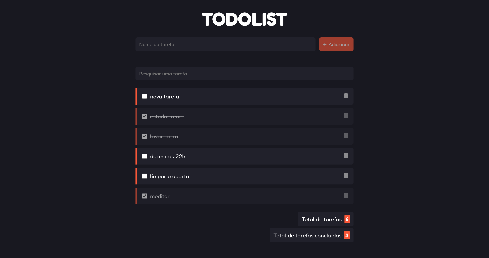

<h1 align="center">
  Todolist
</h1>




## Projeto

Essa é uma lista de tarefas feita com a lib [ReactJS](https://pt-br.reactjs.org/), contendo as seguintes funcionalidades:

- [x] Adicionar nova tarefa
- [x] Remover tarefa
- [x] Pesquisar tarefa
- [x] Marcar tarefa como concluida
- [x] Contador de tarefas criadas
- [x] Contador de tarefas concluidas

## Como executar

Será necessário fazer o clone do projeto

```bash
$ git clone https://github.com/rasmoo-edtech/react-todolist 
```

Instalar as dependências e executar o script de inicialização


```bash
$ npm i

$ npm run dev
```